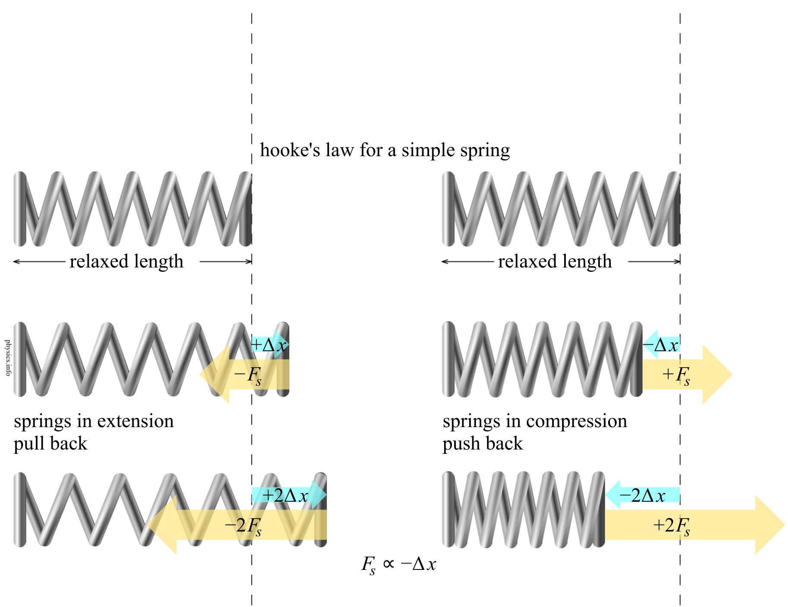
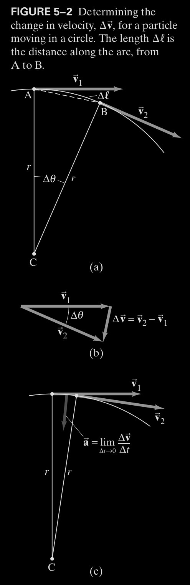
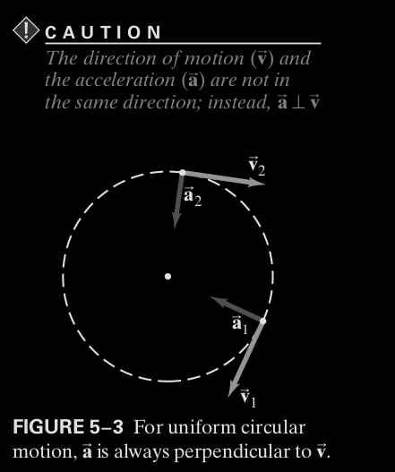

> One must always start a study into the heavily crippled IB editions of the glorious subject of Physics with the initial understanding that the road ahead leads to pain immeasurable.
>
> -> Prime of the Faith

# Track of Variables
> [!IMPORTANT]
> YOU WILL NEED TO KNOW WHAT VECTORS ARE MATHEMATICALLY. THEY WERE ON THE LAST TEST, EVEN MORE SO NOW.
- $\vec{a}$ is the acceleration vector of an object. Has a frame of reference.
- $\vec{F}$ is a force vector. Has a reference frame.
- $\sum{\vec{F}}$ is the sum of all force vectors acting on an object. Also has a reference frame.
- $m$ is mass, a scalar quantity
- $\vec{F}_{fr}$ is taken to mean the force of friction.
- $\mu_s$ is taken to mean the coefficient of static friction while $\mu_k$ is the coefficient of kinetic friction for that surface.
# Newton's laws of Motion

## Force 

- force is any kind of push or pull on an object.
- the force applied on an object due to gravity is called the *force of gravity*
- Any object requires force to get moving from rest
- In order to alter the magnitude or direction of movement, you again are required to apply force
- mass $\ne$ weight
- Force is a vector :)
- mass isn't exactly what you think it is, check [here.](#Mass)
- the gram and its deviates are representative of mass not weight.

## Newton's First Law of Motion
The textbook has a surplus amount of blabber here, so I think i will spare you of it for now.
>   Every object continues in its state of rest, or of uniform velocity in a straight line, as no net force acts on it.

Essentially, the same velocity vector remains without any acceleration acting on it.

Also important to note is that Newton's first law does not hold true in every reference frame. If your reference frame is fixed in an accelerating car, or any accelerating object with force acting on it in order to accelerate the velocity in any way, other objects may be moved toward you. For example, a cup on the dashboard of said car. As long as the cup was in rest in relation to the car when it was in rest or with a constant velocity, the cup might accelerate toward you, while you perceive that no force had acted on the cup in order that it may behave this way. Such reference frames have since been labeled as **inertial reference frames.** Reference frames that aren't accelerating in this manner are therefore called *non-inertial reference frames.* You can also decide between the two based on if the $\mathrm{1}^st$ law of motion hold true. 

## Newton's Second Law of Motion 
The second law makes use of  the concept of mass, so that seems to be next on the agenda. 
### Mass
You might have previously heard the Newtonian definition of mass, which makes it synonymous with a measure for the "quantity of matter" in an object. However, physicists have since come to a consensus that this is a definition sans precision. Mass is the *measure of  the inertia of an object.* The more mass an object has, the greater the force needed to give it a particular acceleration. In other words, get it moving.  

### The Law

> The acceleration of an object is directly proportional to the net force acting on it, and is inversely proportional to its mass. The direction of the acceleration is the direction of the net force acting on the object.

This can directly be written into math like so:
$$
\vec{a}=\frac{\sum{\vec{F}}}{m}
$$
Or as the more commonly seen:
$$
\sum{\vec{F}}=m\vec{a}
$$
Or in an even simpler manner if you assume a 1D world: $F=ma$. No matter the form, all it means is that the *net force* on the object (as show in the summation of force vectors), divided by the mass, is the acceleration applied to the object. Note first that you will almost neevr deal with this equation is the hyper-simple singular dimensional world, because most problems require gravity to be considered. Another valuable insight is how gravity is **not** a part of this equation, as it a phenomenon that creates a force of its own. These forces can also be broken down along side the acceleration vectors into their own dimensions. Read about vectors in [Vectors and Kinematics](kinematics.md) if you don't understand the following.
$$
\sum{F_x}=ma_x
$$
$$
\sum{F_y}=ma_y
$$
$$
\sum{F_z}=ma_z
$$
$$
\sum{F_\dots}=ma_\dots
$$
And so on.

## Newton's Third Law of Motion

>   Whenever one object exerts a force on a second object, the second exerts an equal force in the opposite direction the first.

This is mathematically put down as $\vec{F}_1=-\vec{F}_2$. Below, $\vec{F}_{GP}=-\vec{F}_{PG}$.

In the following illustration, Honest Abe exerts the force of gravity upon the table. Let's say he was about $0.9074074074$ Elons, or 1 Trump($245$ pounds). Firstly, illustration depicts 2 forces that art on the same object, Honest Abe. The downward arrow labeled $\vec{F}_G$ represents the force caused by gravity, and $\vec{F}_N$ represents the reactionary force enacted by the table upon the statue, meaning both act on the statue. A common misconception is that they're the same equal and opposite forces shown in Newton's 3rd Law -- because the 3rd law states that the reactionary force applies on a *different object.* The second image correctly displays the reactionary force to $\vec{F}_N$ as $\vec{F'}_N$, which is exerted on the table by the statue. **Don't ask what happens as a result of the gravitational force, Newton doesn't have a very good answer.**

# Friction

In Newtonian mechanics, Friction is the opposite *but not necessarily equal* force acting on the very object that tries sliding against a static, rigid body. Perfectly smooth objects do not impede moving objects through friction because friction is a result of the microscopic bumps normally found in any surface. When an object slides along a rough surface, the force of **kinetic friction** acts opposite to the direction of the object's velocity.
> [!IMPORTANT]
> Kinetic friction is not a result of Newton's $3^{\mathrm{rd}}$ law of motion.

The force of friction was not derived through theoretical physics, but rather experimental results, so beware of MCQ choices that state the properties of friction absolutely. Through such empirical results, it was found that the force of friction was roughly proportional to the Normal force experienced by the object. The force of friction between hard surfaces is negligibly variant on the surface area in contact, so we can still work with Newtonian physics instead of dynamics. 

Sliding friction is usually called **Kinetic Friction**, the magnitude of which force can be found using:
$$
||\vec{F}_{fr}||=\mu_k*||\vec{F}_N||
$$

There also exists **static friction** which refers to a force parallel to the two surfaces that can arise even when they are not sliding. Usually, this is the force that is exerted when trying to get an object to move. 
$$
0\le||\vec{F}_{fr}||\le\mu_s||\vec{F}_N||
$$

According to this formula, the force of static friction scales up until the object starts sliding along the surface, at which time the force of friction is now of the kinetic kind. You may also be provided tables like these:

> [!NOTE] Example
>   *Friction: static and kinetic.* A $10.0$ kg mystery box rests on a horizontal floor. The coefficient of static friction is $\mu_s=0.40$ and the coefficient of kinetic friction is $\mu_k=0.30$ Determine the force of friction $\vec{F}_{fr}$, acting on the box if a horizontal external applied force $\vec{F}_A$ is exerted on it of a magnitude: \
>   A)  0 \
>   B)  10N \
>   C)  20N \
>   D)  38N \
>   E) 40N 

> [!faq]- Answer
>   $||\vec{F}_N||=9.8*10.0=98\mathrm{N}$, so $0\le||\vec{F}_{fr}||\le\mu_s*98$, where $\mu_s*98=0.4*98=39.2\mathrm{N}$ \
>   A) static friction, $\mu_s=0$ \
>   B) static friction, $\mu_s=10N$ \
>   C) static friction, $20$N is still not sufficient to move the box \
>   D) static friction, $38$N is still not sufficient to move the box, but just barley \
>   E) kinetic friction, $40\mathrm{N}>39.2\mathrm{N}$, $||\vec{F}_{fr}||=0.30*98\mathrm{N}=29.4\mathrm{N}$. $40\mathrm{N}-29.4\mathrm{N}=10.6\mathrm{N}$, to see how fast the box will move: $\frac{||\vec{F}_f||}{10.0\mathrm{kg}}=1.06$ m/s. In freedom units: $2.371152$ Miles an hour.

# Tension

Until this point, we've been ignoring the mysterious forces that enact the forces for the sake of our own misery. Rather than a rigid body applying force, you'll sometimes see the word tension come up in contexts of 'ropes', 'strings', or other objects that serve only to pull on the object of interest.

As shown in the image, tension on a string or another mass-less is a result of Newton's $3^{\mathrm{rd}}$ law of motion. The men pull on the rope, exerting the two middle forces labeled $240$ N and $236$ N respectively. As a result, the rope pulls the blue shirted man by $240$ N. In order to accelerate the whole system to left by $2 \mathrm{m}/\mathrm{s}^2$, Alan has to exert $400$ N of force pushing the earth to the right. As a *result* of Newton's $2^\mathrm{nd}$ law of motion, the Earth exerts 400 N of force on the blue shirted man, leftwards. This is labeled $R_1$. 

To actually calculate the tension on the rope, you have a couple variables to consider: $\vec{F_T}=\langle T\sin\theta, T\cos\theta\rangle$, and $T=||\vec{F_T}||$. The tension amounted to $4$ N because $\theta=0$, $\therefore \sin\theta=0$. And the magnitude of the tension vector itself is:
$$
\sum{\vec{F_r}}
$$
Or the sum of all forces being exerted, on the rope. In situations like elevator cable problems, $\theta=\frac{\pi}{2} \therefore \cos\theta=0$[^1]. If the elevator is accelerating upward at $a \mathrm{m}/{s}^2$, then[^1] 

$$
\sum{\vec{F}}=\langle ma+mg;-\tfrac{\pi}{2}\rangle
$$

# Springs

Springs are explained by something called *Hooke's Law*. It essentially states:

>   Ut tensio sic vic[^2] 

That translates to:

>   As extension, so is force

$$
\therefore \Delta x \propto F 
$$
The actual formula looks like: 
$$
\vec{F}_e=-k\Delta x
$$
The subscript $e$ means 'the elastic force' or the force being exerted *by* the spring. That wording is hyper-specific for a reason, that reason being the slight distinction between the signs of the force vectors while the spring is in different states. As you'll see in the diagram below, a positive $\Delta x$ signifies an extension of the spring, which generates a negative force. The exact opposite is true in any other case.

Like in any other problem of proportionality (in math), $k$ is taken to be the *constant* value of the proportion. The SI unit for the **spring constant** is Newtons per meter. Therefore, it is possible using simple algebra to show:

$$
k=\frac{||\vec{F}||}{x}
$$

# Buoyancy

As shown in the image here, $||\vec{F}_B||$ is not simply equivalent to the weight (that's a force incorporating the force experienced because of gravity). Therefore, it's important to remember the more complicated formulas:

$$
F_1=h_1\rho gA 
$$
$$
F_2=h_2\rho gA 
$$
And the total magnitude of the buoyant force is simply the subtraction of the force pushing the object up and the force pushing the object down: $F_B=F_2-F_1$. Breaking apart these equations, it's important to understand a couple things:

- $\rho$, pronounced *rho* (the *h* is silent) is the density of the fluid. The SI unit for density is $\frac{\mathrm{kg}}{\mathrm{m}^3}$
- *Standard Temperature and Pressure* (STP) is the state of a system at $273.15$ K or $0\degree$ C, at $10^5$ ($1$ bar/$14$ atm) of pressure.
- At STP, the density of water, $\rho_w=0.9982071\approx 1$ g/ml 
- A liter is a measure of volume equivalent to $0.001$ cubic meters, or 1000 cubic centimeters.
- $A$ is the cross sectional area of the object where the object is not parallel to the static particles of the liquid

>   **Archimedes' Principle** \
>   $F_B=w_{\mathrm{fl}}$, but you often need to break this down to really be able to calculate what's required.

## Fraction Submerged

The fraction of an object submerged can easily be found using the following equation:

$$
\frac{V_{\mathrm{sub}}}{V_{\mathrm{obj}}}=\frac{V_{\mathrm{fl}}}{V_{\mathrm{obj}}}
$$

$V_{\mathrm{fl}}$ is the volume of fluid displaced, not the volume of fluid total. 
$$
\frac{V_{\mathrm{fl}}}{V_{\mathrm{obj}}}=\frac{m_{\mathrm{fl}}/\rho_{\mathrm{fl}}}{m_{\mathrm{obj}}/\rho_{\mathrm{obj}}}
$$

The following is only true if the object floats:
$$
\frac{V_{\mathrm{fl}}}{V_{\mathrm{obj}}}=\frac{\rho_\mathrm{obj}}{\rho_\mathrm{fl}}
$$

## Stokes' law 

**Stokes' law** is an empirical law for the frictional forces, or drag force, exerted on spherical objects with very small Reynolds numbers in a *viscous* fluid.

$$
\mathrm{Re}=\frac{uL}{\nu}=\frac{\rho uL}{\eta}
$$

-   $\rho$ is the density of the fluid 
-   $u$ is the flow speed 
-   $L$ is the *characteristic length* or reference scale for the rest of the number. For a flat plate, it is the length of the plate (the distance the fluid may travel unrestricted). For a hollow cylinder or pipe, it is the diameter of the pipe. For a sphere, it is its diameter 
-   $\eta$ (pronounced *eta*) is the *dynamic viscosity* of the fluid
-   **Stokes' law only works when $\mathrm{Re}<1$**
-   $\nu$ is the *kinematic viscosity* of the fluid.

Stokes' law also only functions for spheres. It's usually written as, with all of the aforementioned variables translating perfectly:
$$
||\vec{F}_D||=6\pi\eta Rv
$$

Furthermore, the terminal velocity of an object is when its weight is equal in magnitude and fully opposite in direction to its drag:

$$
||\vec{F}_\mathrm{net}||=mg-||\vec{F}_D||=m\vec{a}=0
$$
# Circular motion

An object that moves in a circle at a constant speed $||\vec{v}||$ experiences **uniform circular motion**. The most important part of that sentence is the constant speed part; the measurement $||\vec{v}||$ is reference to the center of the circle. 

As seen above, a velocity for every point on the path of the circle's motion exits, and the change in the two velocity vectors from any two points separated by $\Delta t$ with respect to time computes the acceleration. As these two vectors become closer in size and more parallel, the difference becomes the vertical difference between the two showed in Figure 5-2 B. The acceleration vector is always directed to the center of the circle.
$$
a_R=\lim_{\Delta t\to0}{\frac{\Delta \vec{v}}{\Delta t}}=\frac{v^2}{r}
$$
$a_R$ is the radial acceleration, otherwise known as the centripetal acceleration. It's easier not to consider centripetal acceleration as a result of the imaginary centripetal force if instead thought of as acceleration experienced by the object radially, or on the radius of motion. A Reynolds number is calculated like so (**you don't need to know this**):

$$
T=\frac{1}{f}
$$

$f$ is the revolutions per second of the object, usually expressed in its SI units: hertz. In radians:

$$
v=\frac{\text{distance}}{\text{time}}=\frac{2\pi r}{T}
$$

It's important to note that the acceleration and velocity vectors at an instant are always perpendicular. Additionally, in uniform circular motion, the magnitude of the acceleration vector is always constant. 

> [!FAQ] Question
> A $150$ gram ball at the end of a string is revolving uniformly in a horizontal circle of radius $0.6$ m. The ball makes 2 revolutions in a second. What is its centripetal acceleration?

> [!NOTE]- Answer
> First recognize the centripetal acceleration formula is $a_R=v^2/r$. $r$ is give. Additionally, we must use the velocity formula for fixed periods: \
> $v=\frac{2\pi r}{T}$. \
> Since the ball makes 2 revolutions in a second, the period $T$ must be $\tfrac{1}{2}$. $v=\frac{2\pi(0.6\mathrm{m})}{0.5}=7.54$, the unit of that output being meters/second. Substituting that value for the speed $v$ in the acceleration formula, acceleration is $94.7 \mathrm{m}/\mathrm{s}^2$

## Angular velocity and momentum

Angular velocity is denoted $\omega$ and is a pseudo-vector usually written in the polar form: $\langle m; \theta \rangle$. From a birds-eye view:
$$
\omega = \frac{\Delta\theta}{\Delta t}
$$

### Uniform Circular Motion 
Going off of the equation above for velocity, the angular velocity is simply:
$$
\omega = \frac{2\pi}{T}
$$
Also:
$$
v=r\omega
$$

### Non-uniform circular motion 

Probably will never need to use this until HL year or the momentum unit (very next one).

$$
\omega(t)=\frac{\mathrm{d}\theta}{\mathrm{d}t}
$$
Angular acceleration:
$$
\alpha=\frac{\mathrm{d}\omega}{\mathrm{d}t}
$$

### Centrifugal force 

Following those formulas (read more [here](https://en.wikipedia.org/wiki/Centrifugal_force)):
$$
||\vec{F}_C||=m\omega^2r
$$
Centrifugal force in this situation is simply the centripetal force as observed from the center of the circular trajectors, in its reference frame. It's fairly easy to convert between the two inertial reference frames with simple algebra. 
# Momentum

> [!NOTE]+
> Calculus ahead. If you're not there, move on or start back at the top. It hardly matters

The momentum of a single particle is written as:
$$
\vec{p}=m\vec{v} 
$$
This is a vector quantity, since velocity is a vector, so a constant multiplied by a vector is still a vector of the same dimensions. Momentum is also incredibly related to force. In differential form, as it was first written, *Newton's $2^\mathrm{nd}$ law* states:
$$
F=\frac{\mathrm{d}p}{\mathrm{d}t}
$$

Additionally - if the net force experienced by an object at any time $t$ is expressed as $F(t)$:
$$
\Delta p = J = \int_{t_1}^{t_2}{F(t)\mathrm{d}t}
$$
$J$ is also something called the *impulse.*

[^1]: I'm working in radians here.
[^2]: This is latin.

#physics
