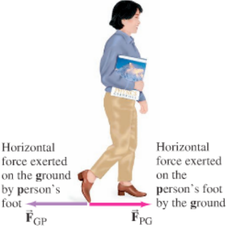
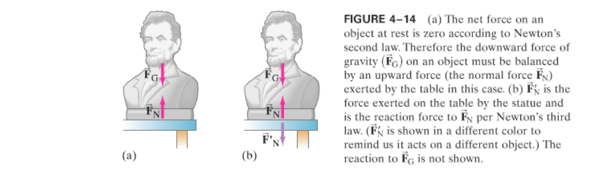
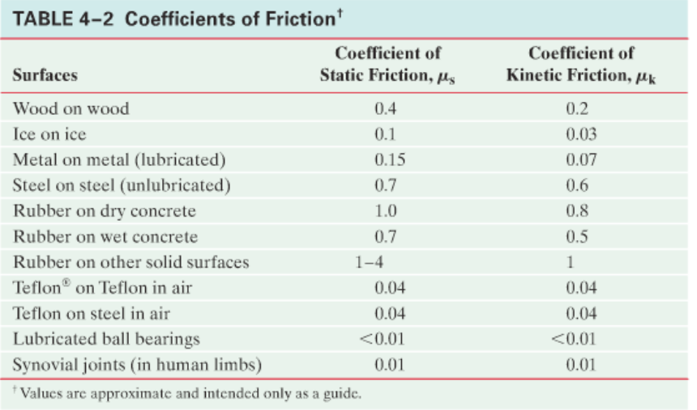

> One must always start a study into the heavily crippled IB editions of the glorious subject of Physics with the initial understanding that the road ahead leads to pain immeasurable.
>
> -> Prime of the Faith

# Track of Variables
> [!IMPORTANT]
> YOU WILL NEED TO KNOW WHAT VECTORS ARE MATHEMATICALLY. THEY WERE ON THE LAST TEST, EVEN MORE SO NOW.
- $\vec{a}$ is the acceleration vector of an object. Has a frame of reference.
- $\vec{F}$ is a force vector. Has a reference frame.
- $\sum{\vec{F}}$ is the sum of all force vectors acting on an object. Also has a reference frame.
- $m$ is mass, a scalar quantity
- $\vec{F}_{fr}$ is taken to mean the force of friction.
- $\mu_s$ is taken to mean the coefficient of static friction while $\mu_k$ is the coefficient of kinetic friction for that surface.
# Newton's laws of Motion

## Force 

- force is any kind of push or pull on an object.
- the force applied on an object due to gravity is called the *force of gravity*
- Any object requires force to get moving from rest
- In order to alter the magnitude or direction of movement, you again are required to apply force
- mass $\ne$ weight
- Force is a vector :)
- mass isn't exactly what you think it is, check [here.](#Mass)
- the gram and its deviates are representative of mass not weight.

## Newton's First Law of Motion
The textbook has a surplus amount of blabber here, so I think i will spare you of it for now.
>   Every object continues in its state of rest, or of uniform velocity in a straight line, as no net force acts on it.

Essentially, the same velocity vector remains without any acceleration acting on it.

Also important to note is that Newton's first law does not hold true in every reference frame. If your reference frame is fixed in an accelerating car, or any accelerating object with force acting on it in order to accelerate the velocity in any way, other objects may be moved toward you. For example, a cup on the dashboard of said car. As long as the cup was in rest in relation to the car when it was in rest or with a constant velocity, the cup might accelerate toward you, while you perceive that no force had acted on the cup in order that it may behave this way. Such reference frames have since been labeled as **inertial reference frames.** Reference frames that aren't accelerating in this manner are therefore called *non-inertial reference frames.* You can also decide between the two based on if the $\mathrm{1}^st$ law of motion hold true. 

## Newton's Second Law of Motion 
The second law makes use of  the concept of mass, so that seems to be next on the agenda. 
### Mass 
You might have previously heard the Newtonian definition of mass, which makes it synonymous with a measure for the "quantity of matter" in an object. However, physicists have since come to a consensus that this is a definition sans precision. Mass is the *measure of  the inertia of an object.^ The more mass an object has, the greater the force needed to give it a particular acceleration. In other words, get it moving.  

### The Law

> The acceleration of an object is directly proportional to the net force acting on it, and is inversely proportional to its mass. The direction of the acceleration is the direction of the net force acting on the object.

This can directly be written into math like so:
$$
\vec{a}=\frac{\sum{\vec{F}}}{m}
$$
Or as the more commonly seen:
$$
\sum{\vec{F}}=m\vec{a}
$$
Or in an even simpler manner if you assume a 1D world: $F=ma$. No matter the form, all it means is that the *net force* on the object (as show in the summation of force vectors), divided by the mass, is the acceleration applied to the object. Note first that you will almost neevr deal with this equation is the hyper-simple singular dimensional world, because most problems require gravity to be considered. Another valuable insight is how gravity is **not** a part of this equation, as it a phenomenon that creates a force of its own. These forces can also be broken down along side the acceleration vectors into their own dimensions. Read about vectors in [Vectors and Kinematics](kinematics.md) if you don't understand the following.
$$
\sum{F_x}=ma_x
$$
$$
\sum{F_y}=ma_y
$$
$$
\sum{F_z}=ma_z
$$
$$
\sum{F_\dots}=ma_\dots
$$
And so on.

## Newton's Third Law of Motion

>   Whenever one object exerts a force on a second object, the second exerts an equal force in the opposite direction the first.

This is mathematically put down as $\vec{F}_1=-\vec{F}_2$. Below, $\vec{F}_{GP}=-\vec{F}_{PG}$.

In the following illustration, Honest Abe exerts the force of gravity upon the table. Let's say he was about $0.9074074074$ Elons, or 1 Trump($245$ pounds). Firstly, illustration depicts 2 forces that art on the same object, Honest Abe. The downward arrow labeled $\vec{F}_G$ represents the force caused by gravity, and $\vec{F}_N$ represents the reactionary force enacted by the table upon the statue, meaning both act on the statue. A common misconception is that they're the same equal and opposite forces shown in Newton's 3rd Law -- because the 3rd law states that the reactionary force applies on a *different object.* The second image correctly displays the reactionary force to $\vec{F}_N$ as $\vec{F'}_N$, which is exerted on the table by the statue. **Don't ask what happens as a result of the gravitational force, Newton doesn't have a very good answer.**

# Friction

In Newtonian mechanics, Friction is the opposite *but not necessarily equal* force acting on the very object that tries sliding against a static, rigid body. Perfectly smooth objects do not impede moving objects through friction because friction is a result of the microscopic bumps normally found in any surface. When an object slides along a rough surface, the force of **kinetic friction** acts opposite to the direction of the object's velocity.
> [!IMPORTANT]
> Kinetic friction is not a result of Newton's $3^{\mathrm{rd}}$ law of motion.

The force of friction was not derived through theoretical physics, but rather experimental results, so beware of MCQ choices that state the properties of friction absolutely. Through such empirical results, it was found that the force of friction was roughly proportional to the Normal force experienced by the object. The force of friction between hard surfaces is negligibly variant on the surface area in contact, so we can still work with Newtonian physics instead of dynamics. 

Sliding friction is usually called **Kinetic Friction**, the magnitude of which force can be found using:
$$
||\vec{F}_{fr}||=\mu_k*||\vec{F}_N||
$$

There also exists **static friction** which refers to a force parallel to the two surfaces that can arise even when they are not sliding. Usually, this is the force that is exerted when trying to get an object to move. 
$$
0\le||\vec{F}_{fr}||\le\mu_s||\vec{F}_N||
$$

According to this formula, the force of static friction scales up until the object starts sliding along the surface, at which time the force of friction is now of the kinetic kind. You may also be provided tables like these:

> [!NOTE] Example
>   *Friction: static and kinetic.* A $10.0$ kg mystery box rests on a horizontal floor. The coefficient of static friction is $\mu_s=0.40$ and the coefficient of kinetic friction is $\mu_k=0.30$ Determine the force of friction $\vec{F}_{fr}$, acting on the box if a horizontal external applied force $\vec{F}_A$ is exerted on it of a magnitude: \
>   A)  0 \
>   B)  10N \
>   C)  20N \
>   D)  38N \
>   E) 40N 

> [!faq]- Answer
>   $||\vec{F}_N||=9.8*10.0=98\mathrm{N}$, so $0\le||\vec{F}_{fr}||\le\mu_s*98$, where $\mu_s*98=0.4*98=39.2\mathrm{N}$ \
>   A) static friction, $\mu_s=0$ \
>   B) static friction, $\mu_s=10N$ \
>   C) static friction, $20$N is still not sufficient to move the box \
>   D) static friction, $38$N is still not sufficient to move the box, but just barley \
>   E) kinetic friction, $40\mathrm{N}>39.2\mathrm{N}$, $||\vec{F}_{fr}||=0.30*98\mathrm{N}=29.4\mathrm{N}$. $40\mathrm{N}-29.4\mathrm{N}=10.6\mathrm{N}$, to see how fast the box will move: $\frac{||\vec{F}_f||}{10.0\mathrm{kg}}=1.06$ m/s. In freedom units: $2.371152$ Miles an hour.

#physics
