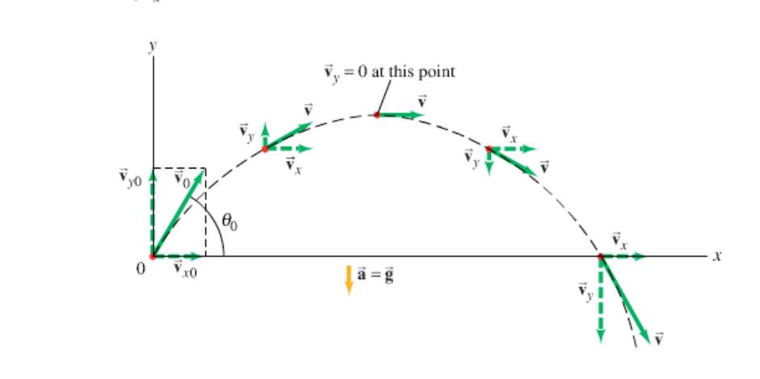

> One must always start a study into the heavily crippled IB editions of the glorious subject of Physics with the initial understanding that the road ahead lead to pain immeasurable.
>
> -> Prime of the Faith

# Motion in 1D 
In this rendering of motion, you will *never* need to use vector quantities to describe movement due to the scalar nature of all quantities discussed.
## Reference Frames and Displacement
- Any measurement about motion is taken in terms of a *reference frame*.
> [!NOTE]
> **Example:** A train that moves with respect to the ground being held stationary, is not moving with respect to a stationary person inside that train. If a person were to walk, at let's say $5$ km/s toward the back of the train while it moves forward at $80$ km/h, the person is moving at $75$ km/h with respect to the stationary ground.
- In one dimension, only one axis, the $x$-axis of a coordinate plane is used.
- the *net* distance an object has traveled is known as *displacement*
- *total distance* is the overall distance traveled by the object/particle regardless of reference frame or initial/final positions
- change in positions is described using $\Delta x$

## Average Velocity
It is important to note that this equation was derived from the more complicated calculus variant of the velocity equation. There are 2 important terms here.

$$
\text{average speed}=\frac{\text{distance traveled}}{\text{time elapsed}}=\frac{\Delta x}{\Delta t}
$$
For any form of velocity, the speed is simply calculated by using the magnitude of the velocity vector $||\vec{v}||$, but since we exist in one dimension now, we will use $|v(t)|$
## Instantaneous Velocity
If the position equation is defined as $x(t)$, then:
$$
\text{instantaneous velocity} = \tfrac{\mathrm{d}x}{\mathrm{d}t} = v(t) = \lim_{\Delta t \to 0}{\tfrac{\Delta x}{\Delta t}}
$$

## Average Acceleration
The acceleration of an object is the rate at which the velocity of said object changes. **Average Acceleration** is defined as the change in velocity from 2 distinct points divided by the change in time between those 2 distinct points.
$$
\text{average acceleration} = \frac{\text{change of velocity}}{\text{time elapsed}}
$$
Or more mathematically:
$$
a=\frac{v_2-v_1}{t_2-t_1}=\tfrac{\Delta v}{\Delta t}
$$

## Instantaneous Acceleration 
If the velocity function is defined as $v(t)$ (this notation only applies to 1 dimension):
$$
a(t)=\tfrac{\mathrm{d}v}{\mathrm{d}t}=\lim_{\Delta t \to 0}{\tfrac{\Delta v}{\Delta t}}
$$
Please take calculus/study calculus if you want a neuron or two to function during the course of this, well, course.

## Motion at Constant Acceleration
During this section and any point you use these formulas, always take $t_0$ to be equivalent to $0=t_1$. This allows for the following line of reasoning:
$$
\bar{v}=\frac{x-x_0}{t-t_0}=\frac{x-x_0}{t}
$$
This clearly makes sense because $x_0$ is taken to be the initial position of the particle in 1D, and $t_0$ is taken to be simply $0$, when the clock starts. Therefore acceleration must be a constant like so:
$$
a=\frac{v-v_0}{t}
$$
Firstly, it is important to note that all variables without subscripts are taken to be definitions of that variable completely. In contrast, when you saw that $v$ had a little *bar* on top of it, $\bar{v}$ meant to be the ***average*** of $v$. Moving on, if you are required to find the velocity of an object after elapsed time $t$:
$$
v=v_0+at 
$$
> [!NOTE]
> **Example:** You are given that the acceleration of a motorcycle is constantly $4.0 \mathrm{m}/\mathrm{s}^2$. You need to find the speed of that motorcycle (note that we haven't given you any sense of position, $\therefore$ did not ask for velocity) after elapsed time $t=6.0\mathrm{s}$. The motorcycle starts from total rest, and when $t_1=t_0=0$. 

> [!faq]- Answer
> $4.0*6.0=24\mathrm{m}/\mathrm{s}$

Next, calculating the position:
$$
x=x_0+\bar{v}t 
$$
Because of the symmetric and uniform growth of the velocity over time:
$$
\bar{v}=(\frac{v_0+v}{2})t=x_0+t(\frac{v_0+v_0+at}{2})=x_0+t(\frac{2v_0+at}{2})
$$
This finally results in the formula for position in these scenarios:
$$
x=x_0+tv_0+\tfrac{1}{2}at^2
$$

## Objects in free fall
Just remember that $g=9.80\mathrm{m}/\mathrm{s}^2$

# Vectors
You haven't seen any vectors to this point yet, so here we go! Vectors are essentially made of 2 components as long as they are two dimensional. You can either specify the relative coordinates they meet or the direction and magnitude. For example, you can write it out as either: $\vec{p}=\langle a,b\rangle$ or as $\vec{p}=\langle m;\theta \rangle$. To convert between them: $\vec{p}=\langle m\sin{\theta},m\cos{\theta}\rangle$

## Adding and Subtracting Vectors:

Now that you understand that, I can say that displacement in 2D is all about a certain amount of movement in $\hat{i}$ direction or $\hat{j}$, then adding or subtracting them to compute the same dimensional cumulative vector. Anywyas, Adding them is as simple as arranging the vectors tail to tip, and then the next tail to tip. Then you compute the vecor formed between the exposed tail and tip. Algebraically, it looks like this:
$$
\langle a,b \rangle + \langle c,d \rangle = \langle a+c,b+d \rangle
$$

## Magnitude 
For the rectangular component vector form:
$$
||\vec{p}||=\sqrt{a^2+b^2}
$$
In more than two dimensions, you would just sum more components in the same fashion as $a$ and $b$. With the circular vector form:
$$
||\vec{p}||=m 
$$
Refer to the stuff above to make sense of this.

## Multiplying a vector and a scalar
$$
c\vec{p}=c\langle a,b \rangle=\langle ca,cb \rangle
$$
# 2D Kinematics

## Calculating Displacement in 2D 
The displacement vector $\vec{D}$ is simply the sum off all movement vectors $\vec{m_{0 \ldots n}}$. You can the calculate the magnitude of that vector to get the distance of the displacement as $||\vec{D}||$

## Projectile motion

Not that this section on projectile motion is very different from the application of the constant acceleration velocity equation to gravity using $-g$ as the acceleration. Here, motion is 2D, and is *propelled*. For an object to be propelled means for that object to have an initial velocity. Additionally, the object will also usually have a lunch angle, starting from $\theta=0$ on the positive $x$ axis. There are generally 2 methods to go about this, with one being a substitution of gravity into another. 

### General Projectile Vectors for Constant Acceleration
Without any further definitions, other than $\vec{v}$ is the velocity vector, $\vec{a}$ is the acceleration vector, and $\vec{s}$ is the position vector. The velocity vector is a function of any given point of time $t$ given as such:
$$
\vec{v}(t)=\vec{v}_0+\vec{a}t=\langle v_{x0}+t(a_x), v_{y0}+t(a_y)\rangle
$$
This can also be visually represented as such:

You can also calculate the square of the velocity vector independent of of the time $t$. This can low-key be helpful when you only have the position vector $\vec{s}$.
$$
\vec{v^2}=\langle v^2_{x0}+2a_x(x-x_0),v^2_{y0}+2a_y(y-y_0) \rangle
$$
The position finally being:
$$
\vec{s}(t)=\vec{s}_0+t\vec{v_0}+\frac{1}{2}\vec{a}*t^2
$$
### Standard Projectile motion with Gravity
First it is defined that $\vec{a}=\langle 0,-g\rangle$. The composite velocity vector is therefore defined as:
$$
\vec{v}(t)=\langle v_{x0}, v_{y0}-gt\rangle
$$
That $g$ is for gravity. It is also important to remember that $\vec{v}=\langle v_0\cos\theta,v_0\sin\theta\rangle$.
$$
\vec{s}=\vec{s}_0+t\vec{v}
$$
#physics
